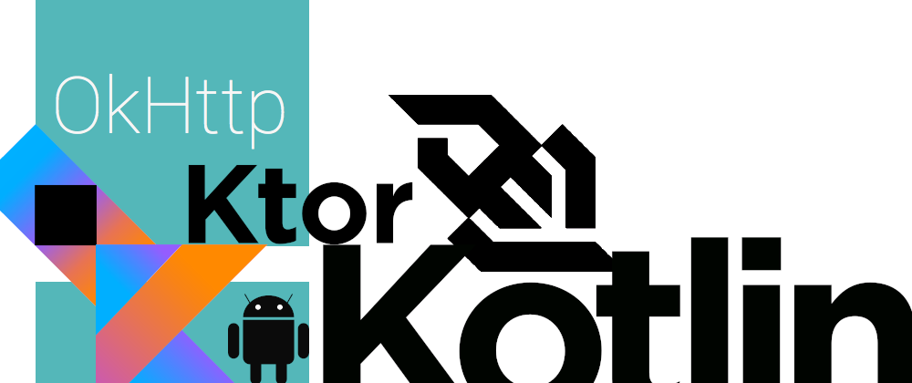

# Simple WebSocket App

Amazon API Gateway added support for WebSockets in December, 2018. [The
original launch
announcement](https://aws.amazon.com/blogs/compute/announcing-websocket-apis-in-amazon-api-gateway/)
includes [a demo app that relays messages between
clients](https://serverlessrepo.aws.amazon.com/applications/arn:aws:serverlessrepo:us-east-1:729047367331:applications~simple-websockets-chat-app).

This Android app provides the ability to read and write messages to that
WebSocket endpoint, hosted in Amazon API Gateway.

To use it:
1. Deploy the Simple WebSockets Chat App.
2. Copy the WSS URL that is created above. It should look something like
   `wss://YOUR_APP_ID.execute-api.YOUR_REGION.amazonaws.com/YOUR_STAGE`.
   Set it as the value of `websocket_url` in
   `app/src/main/res/values/strings.xml`.
3. Import this Project into Android Studio
4. Build and Deploy

Try sending a message to API Gateway with `wscat`:
```console
wscat -c <your_url>
{"action": "sendmessage", "data": "Hello from the other side."}
```

Check what happens on the app. You should see the message there.

You can click the "send message" button in the app to send a message the
listener, too.

## OkHttp & Ktor

Two version of the app are provided:
 1. [One using Ktor](https://github.com/jamesonwilliams/android-websocket-client/blob/ktor/app/src/main/java/org/nosemaj/wsreader/MainActivity.kt), and
 2. [One using OkHttp](https://github.com/jamesonwilliams/android-websocket-client/blob/okhttp/app/src/main/java/org/nosemaj/wsreader/MainActivity.kt)

